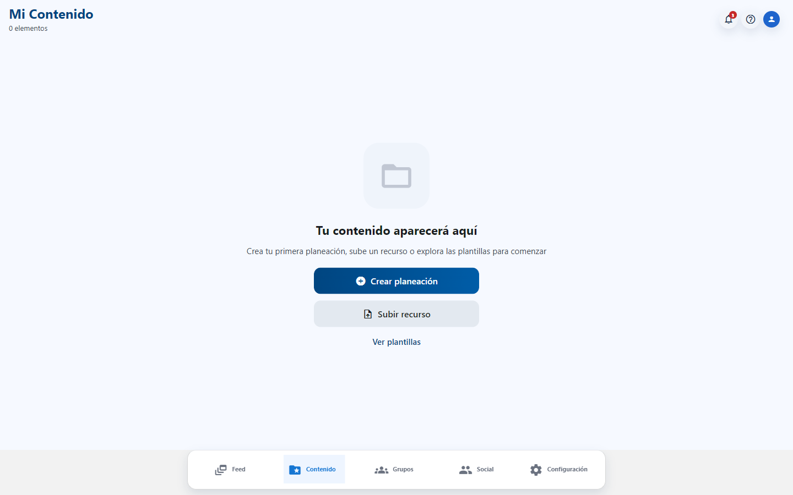
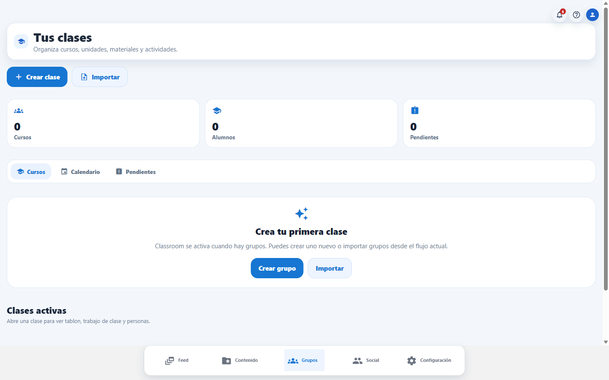
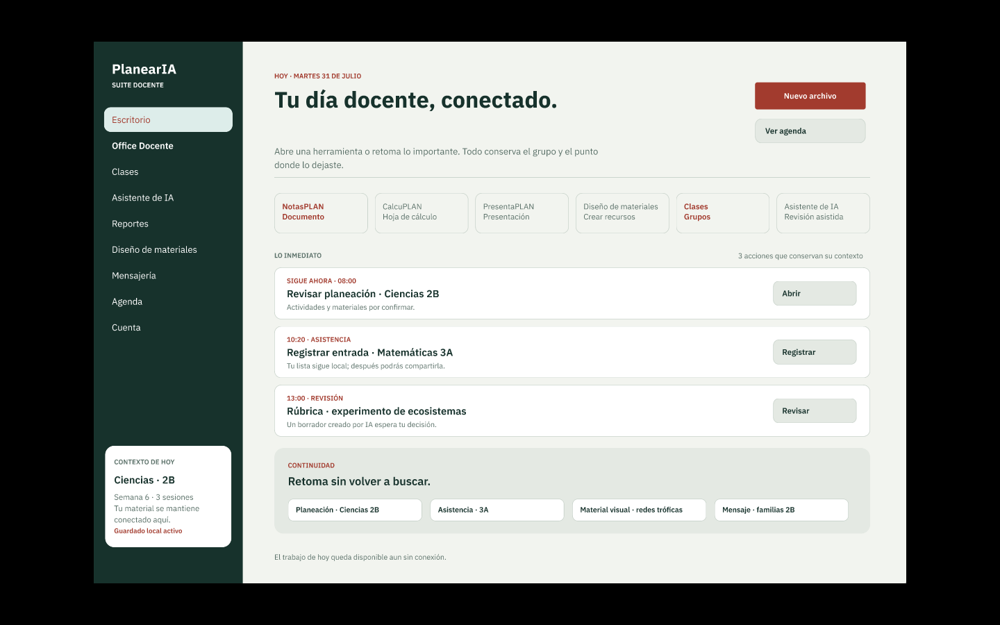
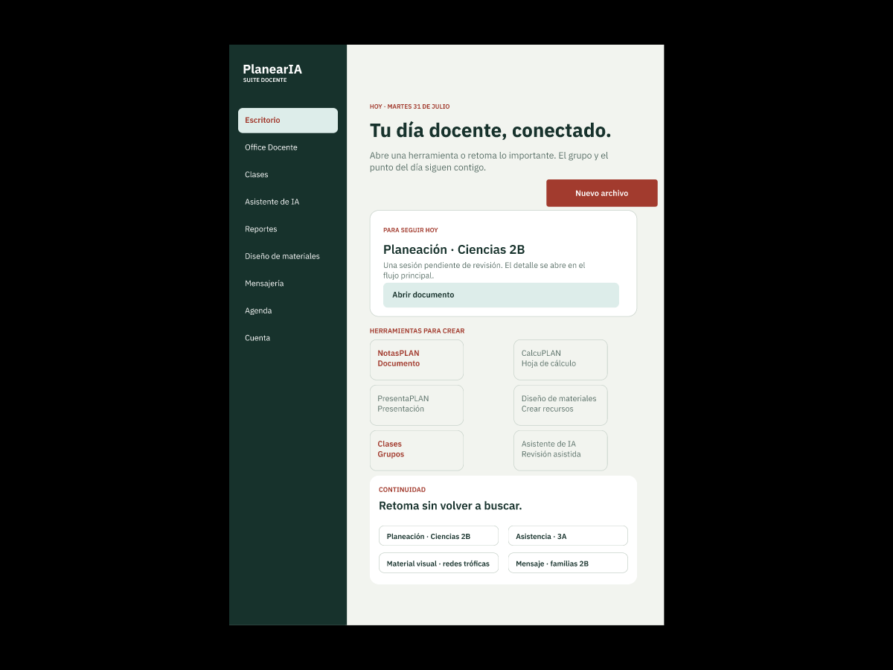
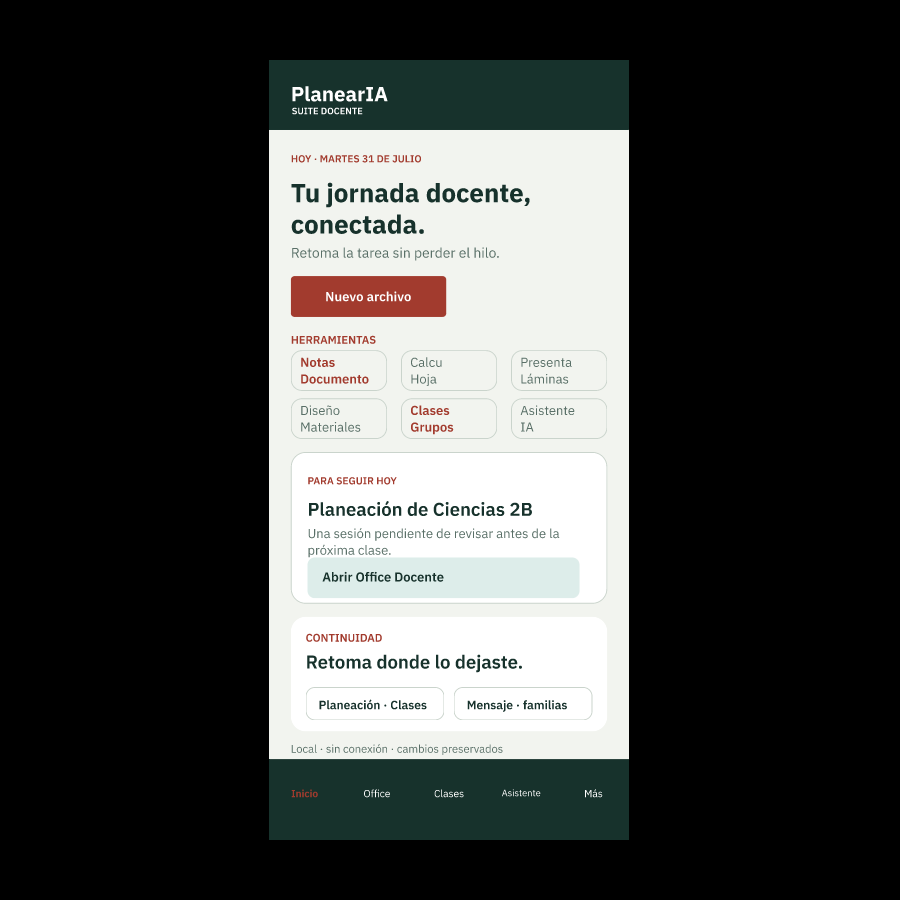

# PlanearIA

Creé PlanearIA para ayudar a los docentes a reducir su carga de trabajo, evitar tareas repetitivas y mantener todo organizado en un solo lugar.

## ¿Qué es PlanearIA?

PlanearIA es una plataforma para docentes que reúne planeaciones, materiales, clases, calendario y herramientas de inteligencia artificial dentro de una misma aplicación.

La idea es que un profesor pueda crear un recurso, organizarlo, asignarlo y darle seguimiento sin tener que pasar por varias aplicaciones o volver a capturar la misma información. La IA funciona como apoyo: puede detectar contexto y proponer el siguiente paso, pero el docente conserva siempre la decisión final.

La visión de PlanearIA es sencilla: que los docentes sigan trabajando como ya lo hacen, pero mucho mejor.

## Capturas

### Aplicación actual

La versión pública permite recorrer PlanearIA como invitado y conocer las áreas que ya forman parte de la aplicación.

_Inicio de PlanearIA y acceso a la creación de planeaciones con ayuda de IA._

_Mi Contenido reúne planeaciones, recursos y plantillas._

_Clases permite organizar grupos, alumnos, actividades y pendientes._

### Visión en desarrollo

Estas pantallas pertenecen al prototipo beta de Figma. Muestran la dirección visual en la que estoy trabajando y todavía no representan la interfaz final de la aplicación.

_Propuesta del Escritorio Docente para computadora._

_Adaptación del mismo escritorio para tablet._

_Vista móvil con accesos rápidos, prioridades y trabajo reciente._

Puedes recorrer la propuesta completa en el [prototipo de Figma](https://www.figma.com/proto/VBK5tK7EQS83tdTmtuBpI9/PlanearIA-%E2%80%94-UX-UI-Ola-2?node-id=307-966&scaling=scale-down&content-scaling=fixed&page-id=60%3A2&hide-ui=1).

## Funciones principales

PlanearIA reúne distintas partes del trabajo docente:

- Creación y organización de planeaciones.
- Biblioteca de materiales, recursos y plantillas.
- Gestión de clases, grupos, alumnos y actividades.
- Herramientas para documentos, hojas de cálculo y presentaciones.
- Asistente de IA con resultados revisables antes de guardar o asignar.
- Trabajo offline y sincronización cuando vuelve la conexión.
- Preferencias de tema, tamaño de texto y accesibilidad visual.

Algunas de estas funciones ya se pueden recorrer en la demo y otras continúan en desarrollo como parte de la visión completa del producto.

## Cómo probar PlanearIA

### Desde el navegador

Entra a [planearai.com](https://planearai.com) y selecciona el acceso como invitado. No necesitas crear una cuenta para recorrer la experiencia pública.

### En Android

Puedes instalar la versión más reciente desde [GitHub Releases](https://github.com/IgnacioBarEsp/PlanearIA/releases/latest). Abre la publicación más reciente y descarga el archivo con extensión `.apk`.

Android puede pedir autorización para instalar aplicaciones que no provienen de Google Play. El APK se publica directamente desde este repositorio.

## Tecnologías

- React Native, Expo y TypeScript para la aplicación multiplataforma.
- React Navigation, Context y hooks para navegación y estado.
- Node.js para el backend y MongoDB para persistencia remota.
- AsyncStorage y SecureStore para almacenamiento local y sesiones.
- Jest y Testing Library para pruebas automatizadas.
- Figma y Playwright para diseño y comprobación visual.
- GitHub Actions y Vercel para integración, entregas y despliegue web.

La arquitectura, las decisiones técnicas y la documentación de desarrollo se encuentran en [`Documentacion/README.md`](Documentacion/README.md).

## Estado actual y próximos pasos

PlanearIA se encuentra en desarrollo activo. La aplicación pública muestra el estado funcional actual, mientras que el prototipo de Figma sirve como guía para la siguiente etapa de su interfaz.

Los próximos pasos están centrados en:

- Llevar el Escritorio Docente del prototipo a la aplicación.
- Conectar mejor las herramientas de creación, las clases y el asistente de IA.
- Mantener una experiencia consistente en computadora, tablet y móvil.
- Seguir mejorando el trabajo offline, la accesibilidad y las pruebas.

## Licencia

Este repositorio es público para consulta, pero no es open source. El código y los recursos conservan todos sus derechos.

## Autor

Soy **Ignacio Barboza Espinoza**, Desarrollador de Software Junior especializado en React Native, TypeScript y Node.js.

Desarrollé PlanearIA como un proyecto personal en el que también adopté prácticas de diseño UX/UI, pruebas automatizadas y desarrollo guiado por especificaciones (SDD). Utilizo GitNexus para dar mejor contexto del código a mis herramientas de IA y hacer más eficiente mi flujo de trabajo.

Contacto: [IgnacioBar.esp@gmail.com](mailto:IgnacioBar.esp@gmail.com)
